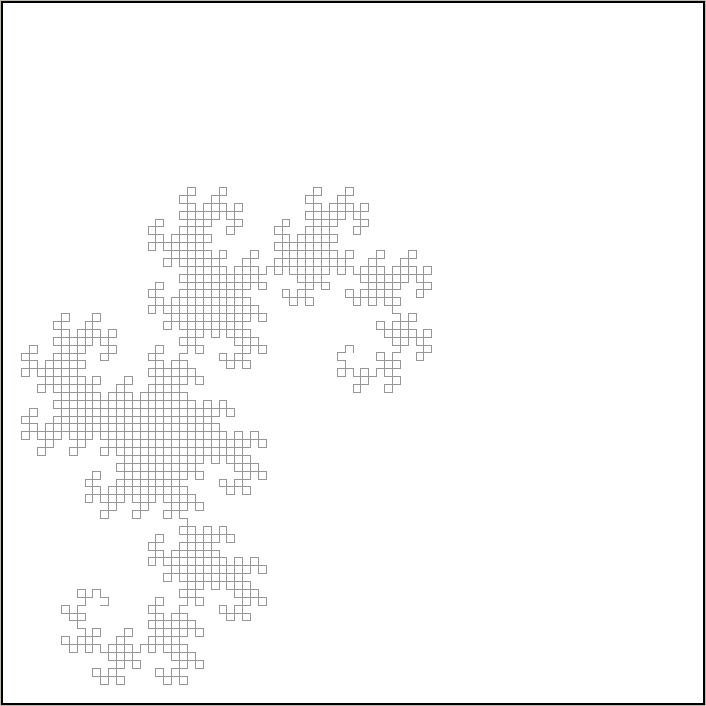
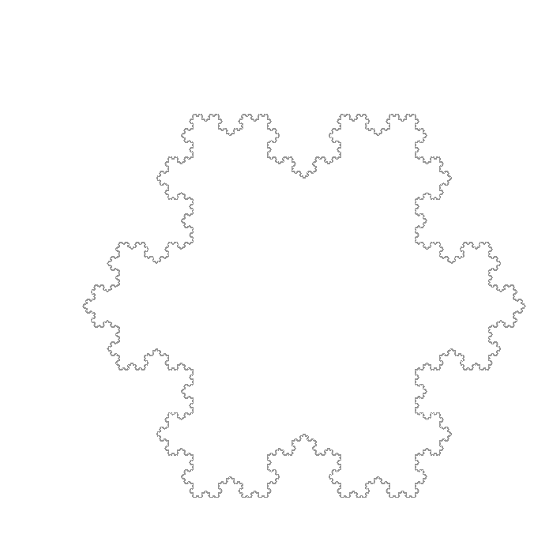

# Rapport

## Identifiants 

nom: Rolley
prénom: Emile
identifiant Git Lab: @EmileRolley
numéro étudiant: 71802612

nom: Phol Asa
prénom: Rémy
identifiant Git Lab: @pholasa
numéro étudiant: 71803190

## Fonctionnalités

Le projet est capable de :
	- dessiner étape par étape un L-Système en appuyant sur une touche (`a | l | j`)
	- revoir le dessin précédent du L-Système en appuyant sur une touche (`p | h | k`)
	- specifier un fichier .sys pour pouvoir le dessiner
	- redimensionner automatiquement le dessin
	- choisir la position où commencer le dessin
	- d'ajouter un dégradé de couleurs au dessin
	- d'ajouter une variation aléatoire au dessin 
	- de sauvegarder le dessin en couleur en une image png

## Compilation et exécution 

### Dépendances

Bibliothèques externes utilisées :

- [OUnit2](https://github.com/gildor478/ounit) pour les tests unitaires.
- [bimage](https://github.com/zshipko/ocaml-bimage) 
- [bimage-unix](https://opam.ocaml.org/packages/bimage-unix/) pour la sauvegarde des images.
	
# Sommaire

[](https://gaufre.informatique.univ-paris-diderot.fr/EmileRolley/pf5/commits/master)
- [Compilation](#compilation)
  - [Prérequis](#prérequis-à-installer)
  - [Docker](#docker)
  - [Make](#make)
  - [Lancement](#lancement)
- [Usage](#usage)
  - [`--help`](#--help)
  - [Options](#options)
  - [_Keymap_](#keymap)
- [Fichiers systèmes](#les-fichiers-.sys)
  - [Exemples de fichier](#exemples-de-fichier-valid)
- [Exemples](#exemples)
  - [Sans option](#interprétation-monochrome)
  - [`--start-pos=center`](#--start-pos=center)
  - [`--line-width=3`](#--line-width=3)
  - [`-s 15`](#-s-15)
  - [Avec couleur](#dégradé-rouge)
  - [Sauvegarde d'image](#sauvegarde)

## Compilation
### Prérequis à installer

Voir [INSTALL.md](../INSTALL.md)

- ocaml évidemment
- dune et make sont fortement conseillés
- bibliothèque graphics si elle ne vient pas déjà avec ocaml
- [OUnit2](https://github.com/gildor478/ounit) pour les tests unitaires.
(`opam install ounit2`)
- [bimage](https://github.com/zshipko/ocaml-bimage) et [bimage-unix](https://opam.ocaml.org/packages/bimage-unix/)
pour la sauvegarde des images.

### Docker

Pour ne pas avoir à installer toutes les dépendances il est possible d'utiliser
l'image `Docker`

[emilerolley/opam2-dune](https://hub.docker.com/r/emilerolley/opam2-dune)

#### Comment l'utiliser

Pour récupérer l'image, utiliser :

```shell
> docker pull emilerolley/opam2-dune:latest
```

Pour pouvoir ouvrir la fenêtre de la lib `graphics`, utiliser :

```shell
> docker run --rm -ti --net=host -e DISPLAY emilerolley/opam2-dune
```

### Make

Liste des commandes `Make` disponible :

- `make` compile l'exécutable *./_build/default/main/main.exe*.

- `make test` compile et exécute les tests unitaires.

- `make clean` efface le répertoire provisoire `_build`
    produit par `dune` lors de ses compilations.

### Lancement

Pour lancer l'exécutable, `./run arg1 arg2 ...`.

## Usage

### `--help`

L'option `--help`, permet d'afficher la page d'aide.

```shell
>./run --help
Usage:
                ./run.sh -f sys_file [ options ]

Needed:
  -f            Input file where the L-System is described

Options:
  -s            Value for the aleatory shifting in the interpretation
  -o            The output file where final image will be saved to
  --line-width  Positive integer used for initialized the line width
  --color       Rendering color accepted values :
                     red, blue, green, magenta, cyan, yellow, (default: grey)

  --start-pos   The starting position accepted values :
                     center, bottom, top, center-left, center-right, bottom-left,
                     bottom-right, top-left, top-right (default: bottom)

  -help        Display this list of options
  --help       Display this list of options
```

### Options

#### `-f`

L'option `-f` est nécessaire et permet de spécifier le fichier *.sys* décrivant
le L-Système voulant être visualisé (voir la section [Les fichiers _.sys_](#les-fichiers-.sys)
pour plus de détails).

#### `-s`

L'option `-s` permet de définir un **entier positif** qui corresponds à la
variation potentielle de l'interprétation de la valeur des angles.
Plus la valeur est grande plus la variation sera grande.

#### `-o`

L'option `-o` permet de préciser le chemin vers le fichier dans lequel pourra être
sauvegardée la représentation.

> Format disponible : `PNG`.
>
> Les couleurs ne sont pas encore disponible.

#### `--line-width`

L'option `--line-width` permet de définir l'épaisseur du trait (la valeur doit
être un entier positif).

> Par défaut, `--line-width=1`.

#### `--color`

L'option `--color` permet de visualiser le L-Système avec un dégradé monochrome.

Liste des couleurs disponibles :

- rouge (*red*)
- bleu  (*blue*)
- vert  (*green*)
- jaune (*yellow*)
- magenta (*magenta*)
- bleu ciel (*cyan*)

> Si l'option n'est pas précisée la couleur utilisée sera grise.

#### `--start-pos`

L'option `--start-pos` permet de définir la position de départ de l'interprétation.

> Par défaut, `--start-pos=bottom`.

#### `--verbose`

L'option `--verbose` permet d'afficher des informations supplémentaires lors
de l'exécution du programme.
Elle principalement utilisée pour le _debuggage_.

Exemple de messages :

```shell
> ./run -f examples/snow.sys -o img/snow.png --verbose
[INFO] - Color       = 'false'
[INFO] - Shifting    = '0.000000'
[INFO] - Src file    = 'examples/snow.sys'
[INFO] - Dest file   = 'img/snow.png'
[INFO] - L-System created
[INFO] - n = 1, current_word = 'A++A++A'
[INFO] - n = 2, current_word = 'A-A++A-A++A-A++A-A++A-A++A-A'
[INFO] - n = 3, current_word = 'A-A++A-A-A-A++A-A++A-A++A-A-A-A++A-A++A-A++A-A-A-A++A-A+
+A-A++A-A-A-A++A-A++A-A++A-A-A-A++A-A++A-A++A-A-A-A++A-A'
```

### _Keymap_

Lorsque l'interprétation est lancée, il est possible de :

- visualiser l'itération suivante avec `a | l | j`
- visualiser l'itération précédant avec `p | h | k`
- sauvegarder l'interprétation courante avec `s`
(possible uniquement si l'option [`-o`](#-o) est précisée).

> La fenêtre de visualisation peut être fermée à tout moment, simplement, en appuyant
> sur n'importe quelle touche autre que `a l j p h k s`.

## Les fichiers _.sys_

Un fichier _SYS_ est divisé en trois parties, chacunes séparées par une ligne
vide.

Voici quelques contraintes :

- Les lignes commençant par `#` sont ignorées.
- Une règle de réécriture est de la forme : `<Symbole> <Mot>`
- Une interprétation est de la forme : `<Symbole> <Commande>[ <Commande>]`

> **Remarque** : Si une un symbole possède plusieurs règles de réécriture ou
> d'interprétations ce sera la dernière qui sera utilisée.

### Exemple de fichier valide

```markdown
# Axiome
A+B

# Regles de réécriture
A BB
B A

# Interprétation
A L30 T60
+ T60
- T-60
```

> Le répertoire _./examples_ contient plusieurs exemples de fichiers système.

## Exemples

### Interprétation monochrome

```shell
> ./run -f examples/br5.sys
```


### `--start-pos=center`

```shell
> ./run -f examples/dragon.sys --start-pos=center
```



### `--line-width=3`

```shell
> ./run -f examples/dragon.sys --start-pos=center --line-width=3
```


### `-s 15`

```shell
> ./run -f examples/htree.sys -s 15
```


### Dégradé rouge

```shell
> ./run -f examples/br2.sys --color=red
```


### Sauvegarde

```shell
> ./run -f examples/snow.sys -o img/snow.png --start-pos=bottom-right
[INFO] - Saving PNG image at 'img/snow.png' the iteration 6
```



####### IV. Découpage modulaire :

png.ml: 
	Ce module a pour but de transformer et sauvegarder l'interprétation graphique du 
	L-Système en une image png. Elle utilise les bibliothèques externe bimage et bimage-unix 
	pour faire cela.

test_systems.ml: 
	Ce module permet de gérer les tests liées à la création des L-Système 
	dans le projet. Elle utilise la bibliothèque OUnit2 pour les tests.

system.ml: 
	Ce module permet de gérer tout les calculs fait sur les L-Systèmes de la création
	du L-Système à partir d'un fichier .sys, au calcul des évolutions du L-Système.

turtle.ml:
	Ce module à pour but de gérer l'interprétation graphique d'un L-Système en ajoutant
	éventuellement de la couleur ou alors des variations aléatoires au dessin.
	
main.ml:
	Ce module permet de gérer les différentes options possible et de lancer
	l'application.

####### V. Organisation du travail :

Au début du projet :
	Rémy : 
		- Calcul de l'évolution suivante du L-Système.
		- La version basique de la Tortue.
		- Interprètation graphique un L-Système donné.
		
	Emile : 
		- Installer le CI/CD ainsi les tests unitaires du projet.
		- Diviser le projet en plusieurs packages.
		- Parser un fichier .sys en un L-Système utilisable par le projet.
		- Redimensionner automatiquement une interprétations de L-Système.
		- Première version du main avec la gestion des options

Vers le milieu du projet :
	Rémy :
		- Variation aléatoire dans l'interprétation graphique.
		- Possibilité d'avancer ou revenir en arrière dans l'évolution .
	
	Emile :
		- Sauvegarde de l'interprétation courrante en une image png en noir et blanc.
		- Couleur rouge avec dégradé pour l'interprétation de la Tortue.
	
Vers la fin du projet :
	Rémy :
		- Ajouter plusieurs couleurs à la Tortue à la place d'une seule
		- Modifier certaines fonctions en un style réccursif
	Emile : 
		- Nettoyer le Parser
		- Refactoriser certaines fonctions
		- Ajout de la sauvegarde des interprétations en couleurs.
